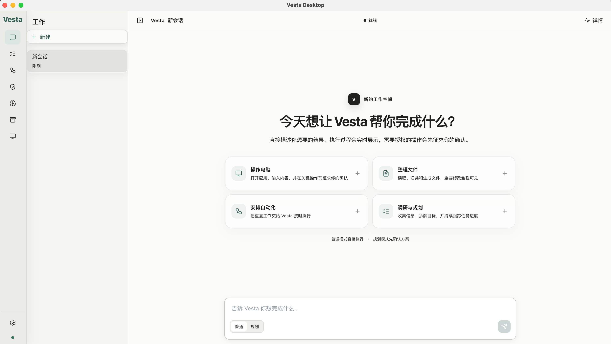
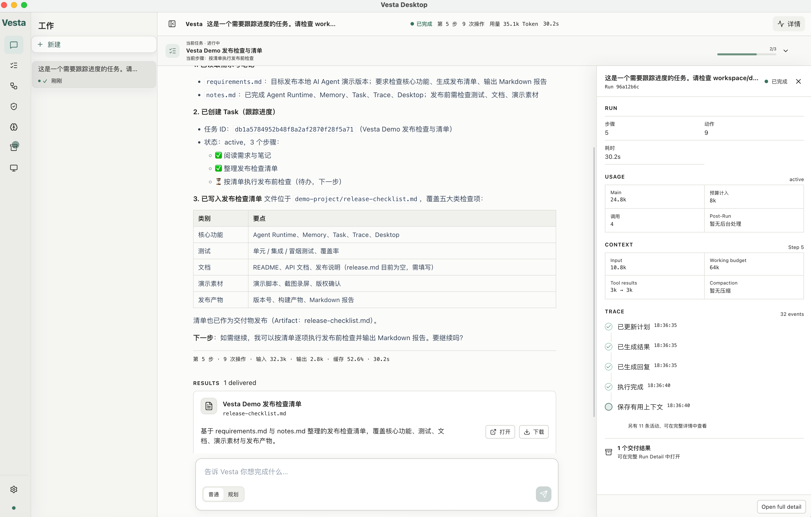
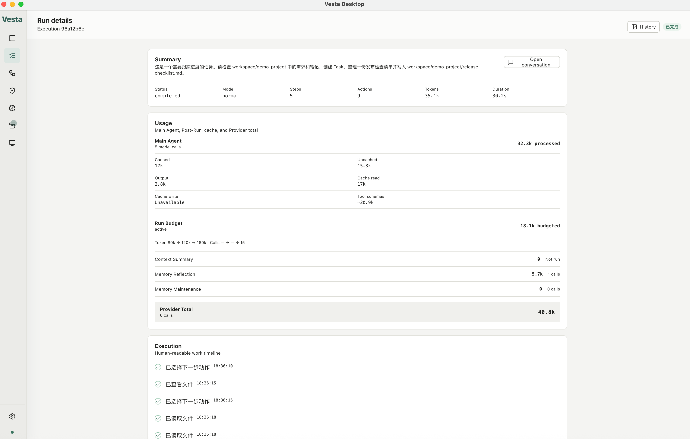

<div align="center">

# Vesta

**Build agents that remember, continue, and learn.**

一个面向长期工作、在本地持续运行的 AI Agent Harness。

[](https://github.com/yitengrunyi/vesta/actions/workflows/ci.yml)


[演示](#demo) · [核心能力](#what-vesta-can-do) · [架构](#how-it-fits-together) · [快速开始](#quick-start) · [评测](#evaluation)

</div>

Vesta 是一个面向长期工作的本地 AI Agent Harness。它不只完成当前对话，还会管理
长上下文、跟踪复杂任务、恢复中断 Run、使用本地与 MCP 工具，并从真实完成的工作中
逐步形成可复用的记忆与 Skill。

当前项目由 Python Host、Electron Desktop 和 macOS 原生 Computer Helper 组成，模型层
通过统一 Adapter 接入 OpenAI、Qwen、DeepSeek 与 Anthropic。

> 当前阶段为本地开发版本，接口、数据格式和交互仍可能调整。

## Demo

以下截图来自真实的本地 Run，不是静态概念稿。

### 84 秒完整演示

<p align="center">
  <a href="https://raw.githubusercontent.com/yitengrunyi/vesta/main/docs/assets/vesta-demo.mp4">
    
  </a>
</p>

<p align="center">
  <a href="https://raw.githubusercontent.com/yitengrunyi/vesta/main/docs/assets/vesta-demo.mp4"><strong>▶ 点击封面或此处观看完整演示</strong></a>
  · Task 跟踪 · 文件工具 · Desktop 操作 · Artifact 交付
</p>

### Agent Workspace

<p align="center">
  <a href="docs/assets/vesta-workspace.png">
    
  </a>
</p>

<p align="center"><sub>统一工作台：从自然语言目标开始工作，在普通模式与规划模式之间切换。</sub></p>

### Long-Running Work

<p align="center">
  <a href="docs/assets/vesta-task-run.png">
    
  </a>
</p>

<p align="center"><sub>复杂任务的步骤进度、工具执行、交付物与 Run 状态在同一会话中持续可见。</sub></p>

<details>
<summary><strong>查看 Run Detail 与长期记忆</strong></summary>

#### Run Detail & Trace

<p align="center">
  <a href="docs/assets/vesta-run-detail.png">
    
  </a>
</p>

模型调用、Token、缓存、Run Budget、Post-Run 与执行轨迹使用同一份运行数据进行解释。

#### Long-Term Memory

<p align="center">
  <a href="docs/assets/vesta-memory.png">
    
  </a>
</p>

Core Memory 随 Run 进入上下文，Ordinary Memory 只提供索引，由模型在需要时主动读取。

</details>

## What Vesta Can Do

- **Multi-Provider Models** — 统一适配 OpenAI、Qwen、DeepSeek 和 Anthropic API。
- **Tool System** — 本地文件、Shell、网页搜索、时间等工具共享注册、超时、权限和审计边界。
- **MCP Extensions** — 通过 Desktop 导入和管理外部 stdio MCP Server，工具进入同一执行链。
- **Memory** — Core Memory 常驻，Ordinary Memory 按索引由模型主动读取，并在 Run 后反思更新。
- **Task / Plan Mode** — 一个整体目标对应一个 Task，使用 Steps 跟踪复杂工作的真实进度。
- **Skill & Skill Learning** — 按需激活 Skill，并从多个 Completed Task 的 Trace 中提炼候选经验。
- **Context Management** — 每轮整理工具结果，超过预算后滚动摘要，同时保留当前目标和关键状态。
- **Run / Recovery** — 持久化 Run 生命周期，通过 Checkpoint 从中断边界创建恢复 Run。
- **Trace & Usage** — 记录模型、工具、审批、压缩和 Post-Run 事件，并拆分缓存与可计费用量。
- **Automation** — 支持 once、interval 和 cron，将定时输入送入正常 Conversation/Run 链路。
- **Async Approval** — 高风险工具可后台等待用户审批，Desktop 浮窗负责继续或拒绝执行。
- **Computer Runtime (macOS)** — 原生 Helper 提供结构化观察、目标验证和受控桌面操作。
- **Artifacts** — 将 Run 生成的文件或链接作为可追踪交付物发布到 Desktop。
- **Desktop** — 提供聊天、实时执行过程、Task、Memory、Run、Trace、Automation、Approval 和扩展管理。

## How It Fits Together

```text
Desktop / CLI / Automation
           ↓
ConversationService
           ↓
       RunManager
           ↓
      AgentRuntime
       ↙       ↘
Context          ToolRegistry → Permission → Executor → Hooks
  ↓                                      ↓
Model Adapter                     Local / MCP / Computer
           ↓
Trace · Checkpoint · Usage · Artifact

Post-Run
  ├─ Memory Reflection / Maintenance
  └─ Task-backed Skill Learning
```

Desktop 与 Host 的正常业务链路是：

```text
Desktop
  ↓
WS /rpc (JSON-RPC)
  ↓
Vesta Host
  ↓
ConversationService / RunManager / AgentRuntime
```

`GET /health`、Computer screenshot 和 Artifact content 只承担本地 transport；正常业务
通过 `WS /rpc` 完成。Host 默认只接受 loopback 客户端。

## Core Concepts

| 概念 | 职责 |
| --- | --- |
| Conversation | 保存用户与 Agent 的完整原始消息历史 |
| Context | 为当前模型请求整理预算、工具结果和滚动摘要 |
| Task | 记录当前长期目标、Steps 和进度 |
| Memory | 保存跨会话仍值得知道的事实、偏好和决定 |
| Skill | 保存以后处理同类任务时可复用的方法 |
| Run | 表示一次 Agent 执行的完整生命周期 |
| Trace | 记录一次 Run 实际发生了什么 |
| Checkpoint | 保存中断后的可恢复边界 |
| Artifact | 表示一次 Run 可交付的文件或链接 |
| Automation | 描述未来何时向 Conversation 投递新输入 |

## Quick Start

### Requirements

- Python 3.12+
- Node.js 22+
- macOS：只有使用 Computer Runtime 时需要，并需授予辅助功能权限

### 1. Clone and install Backend

```bash
git clone https://github.com/yitengrunyi/vesta.git
cd vesta

python -m venv backend/.venv
backend/.venv/bin/python -m pip install -r backend/requirements.txt
cp backend/.env.example backend/.env
```

在 `backend/.env` 中至少配置一个 Provider。真实 API Key 只应保存在本地 `.env` 或
Desktop 设置使用的系统凭据中，不要提交到 Git。

### 2. Start with CLI

```bash
cd backend
.venv/bin/python -m app.models.chat
```

CLI 可用于快速验证模型、工具、会话恢复、Memory、MCP、Run 和 Trace。

### 3. Start Vesta Host and Desktop

终端 1：

```bash
cd backend
.venv/bin/python -m app.server
```

终端 2：

```bash
cd desktop
npm install
npm run electron:dev
```

纯浏览器 Renderer 调试可以使用 `npm run dev`，完整桌面能力需要 Electron。

## Extensions

### MCP

Desktop 的“设置 → 扩展能力”支持粘贴 GitHub 地址或外部 `mcpServers` JSON，先展示解析
结果和即将执行的命令，再由用户确认安装。MCP 工具注册后仍会经过 Vesta 的权限、执行、
Hook 和 Trace 链路。

### Skills

Skill 可以由用户导入，也可以由 Skill Learning 从多个已完成 Task 的真实 Trace 中生成
Candidate。学习产生的 Candidate 不会绕过人工确认直接成为正式 Skill。

## Evaluation

Vesta 已建立统一的 Core、Memory 和 Skill Learning Eval：

- 68 个稳定性单元，每项重复 3 次，共 204 个 Live 样本；
- 192/204 通过，样本通过率 94.1%；
- 稳定场景通过率 83.8%；
- 安全场景通过率 94.4%；
- 平均可计费 Token 2767，平均缓存命中率 75.5%。

完整设计、指标演进和诚实边界见 [docs/eval.md](docs/eval.md)。正式报告位于
`backend/tests/eval_legacy/reports/comprehensive/`，Baseline 位于
`backend/tests/eval_legacy/reports/baselines/`。

> Live Eval 结果绑定当时的模型、场景定义和工作树状态，不代表所有 Provider 或后续版本
> 自动拥有相同结果。

## Development Checks

Backend：

```bash
cd backend
.venv/bin/python -m pip install -r requirements.txt -r requirements-dev.txt
.venv/bin/python -m pytest
.venv/bin/ruff check .
.venv/bin/python -m compileall -q app tests
```

Desktop：

```bash
cd desktop
npm ci
npm test
npm run typecheck
npm run build
```

Native macOS Helper：

```bash
cd native/macos-computer-helper
swift build
swift Tests/protocol_check.swift
```

GitHub Actions 会运行以上 Backend、Desktop 和 Native macOS 基线。

## Repository Layout

```text
vesta/
├── backend/                         Python Harness、Host、CLI 与测试
│   ├── app/
│   │   ├── agent/                   AgentRuntime 与事件
│   │   ├── context/                 上下文构建与压缩
│   │   ├── tools/                   本地工具、权限、Executor 与 Hooks
│   │   ├── memory/                  Core / Ordinary Memory
│   │   ├── task/                    Task 与 Plan Mode
│   │   ├── skills/                  Skill Store 与运行时激活
│   │   ├── skill_learning/          Trace-backed Skill Learning
│   │   ├── run/                     Run 生命周期与 Recovery
│   │   ├── checkpoint/              恢复边界
│   │   ├── automation/              Automation 领域模型
│   │   ├── scheduler/               定时调度
│   │   ├── computer/                Computer Runtime
│   │   ├── mcp/                     MCP Client
│   │   └── server/                  Vesta Host 与 WS /rpc
│   └── tests/                        离线测试、E2E 与 Eval
├── desktop/                          Electron + React + TypeScript + Vite
├── native/macos-computer-helper/     macOS 原生 Helper
├── workspace/                        Agent 被允许操作的本地工作区
└── docs/                             设计、学习记录与评测报告说明
```

## Current Boundaries

- Vesta 目前以本地单用户环境为目标，不是公网多租户服务；
- Computer Runtime 当前只支持 macOS；
- MCP 当前主要接入 stdio Server；
- Skill Learning 生成 Candidate，不自动绕过人工确认；
- 完整 Live Eval 成本较高，日常开发默认运行离线测试，发布前才运行完整 Regression。
